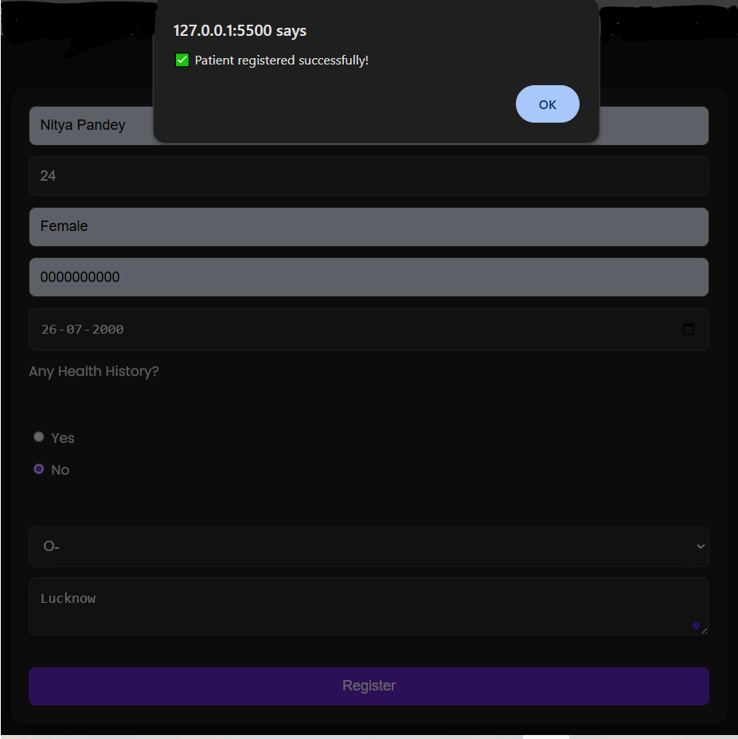
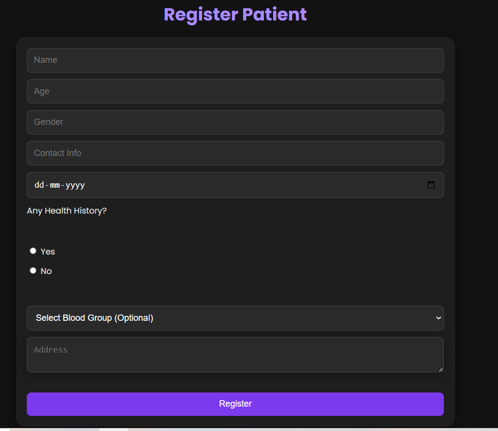
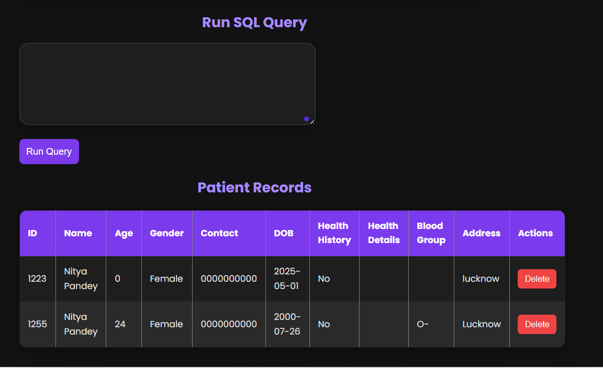
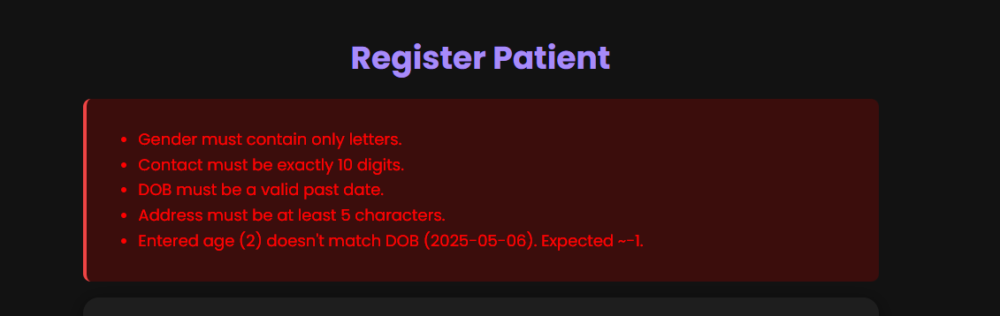

# 🏥 Patient Registration App

A **frontend-only** patient registration app using [PGlite](https://github.com/lvce-editor/pglite), designed to work entirely in the browser without any backend or server.

---

## ✨ Features

- 📋 Register new patients via a modern UI form.
- 🔎 Query patient records using SQL.
- 💾 Persistent storage across page refreshes using IndexedDB.
- 🧠 Works across multiple browser tabs with real-time sync.
- 🎨 Clean, dark-themed responsive design.
- 🔐 Input validation with smooth UX and scroll-to-error support.

---

## 🧪 Technologies Used

- HTML, CSS, JavaScript
- [PGlite](https://github.com/lvce-editor/pglite) – SQLite in the browser
- IndexedDB – for persistent storage
- BroadcastChannel – for cross-tab communication

---

## 🚀 Getting Started

### 1. Clone the Repository

```bash
git clone https://github.com/your-username/patient-registration-app.git
cd patient-registration-app
```

### 2. Open the App

Just open `index.html` in your browser. No installation or build tools needed!

---

## 💻 Usage Instructions

- Fill out the form to register a patient (fields like name, age, gender, etc.).
- Click **Register** to save the record.
- Use the **SQL query input** (e.g. `SELECT * FROM patients;`) to fetch patient records.
- The data remains available across page refreshes.
- Open multiple tabs – data syncs in real time.

---

## 🧾 Commit History Guide (Atomic Commits)

Each major feature is tracked with a clear commit message. Follow this style for clean history:

```bash
git init
git add .
git commit -m "Initial commit with HTML, CSS, and JS structure"
git commit -m "Implement patient registration form UI"
git commit -m "Add PGlite setup and create patients table"
git commit -m "Implement logic to insert and display patient data"
git commit -m "Add SQL query support with SELECT and INSERT support"
git commit -m "Use IndexedDB to persist PGlite database across refresh"
git commit -m "Add multi-tab support using BroadcastChannel"
git commit -m "Add form validation and scroll-to-error feature"
git commit -m "Improve dark theme styling and mobile responsiveness"
git commit -m "Update README with setup, usage, and commit history"
```

> ✅ **Tip**: Commit after each significant logical unit or feature. This makes your history readable and easy to debug.

---

## 📦 Project Structure

```
patient-registration-app/
├── index.html       # Main HTML structure
├── style.css        # Styling (Dark theme)
├── main.js          # App logic (form, DB, validation, sync)
├── README.md        # Project overview and instructions
└── .gitignore       # (Optional) Ignore system files or build output
```

---

## ⚠️ Known Limitations

- Only supported on modern browsers that support `IndexedDB` and `BroadcastChannel`.
- SQL support is limited to what [PGlite](https://github.com/lvce-editor/pglite) provides.
- No backend, so data is limited to the user's browser/device.

---

## 🛠️ Challenges Faced

- ⚙️ Making sure database changes persist with `IndexedDB` using async setup.
- 🔄 Keeping patient data **synchronized across tabs** with `BroadcastChannel`.
- 📥 Handling dynamic queries and schema creation without breaking UX.
- 🚨 Designing real-time **form validation** with clear inline error feedback and scroll-to-error.

---

## 📸 Screenshot






> To use this: capture a screenshot of the working app, name it `screenshot.png`, and place it in the root folder.

---

## 📝 License

MIT – Free to use and modify.
